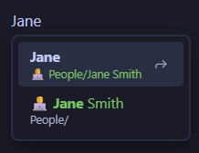

# Littera Nexa

Link to a note by typing its name. No `[[` needed.

> *Littera nexa* — Latin for "the linked letter".

A convenience function that removes the need to type `[[` before creating a wikilink. Common use
cases:

- Linking to the same notes frequently, e.g. notes from a People folder
- Auto-suggesting a link when you forgot to link
- Helping fast typers who mistype `[{Jane` and don't get any suggestions from Obsidian

The suggestion list mimics Obsidian's behaviour as much as it can, with configurable elements under
**Settings → Littera Nexa**.

---

## Troubleshooting

If the list doesn't open, check these:
 - The word starts with a lowercase letter, and **Starts with a capital** is on
 - You have typed fewer characters than **Minimum characters**
 - The note is outside the folders you selected, or inside one you excluded
 - The cursor is in a section that is switched off, e.g. a code block
 - The cursor is in the middle of a word
 - The note is the one you are editing, which is never offered

---

## License

[GPL-3.0-only](LICENSE)
